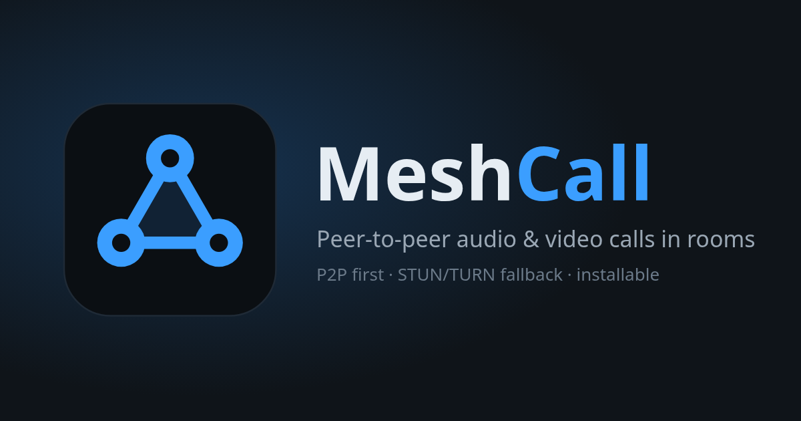
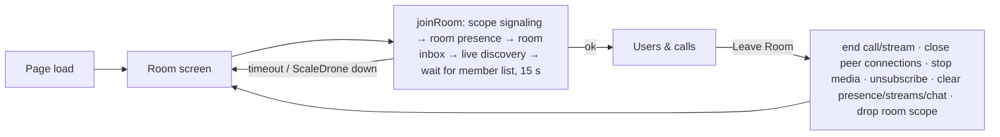
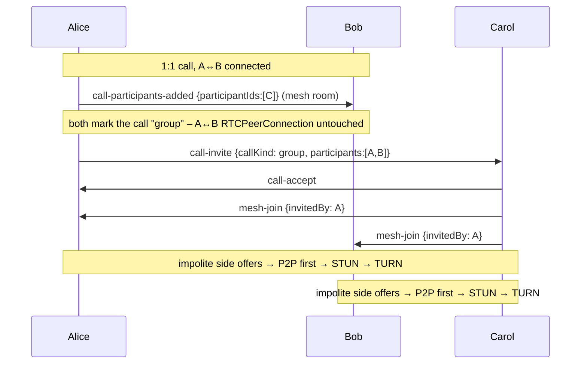
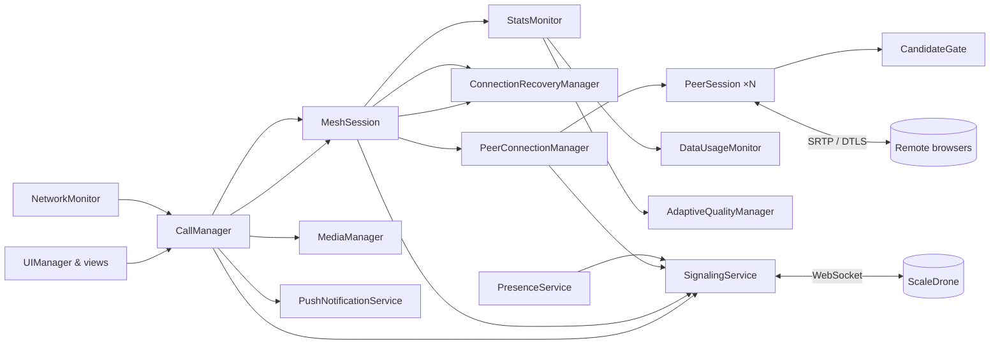
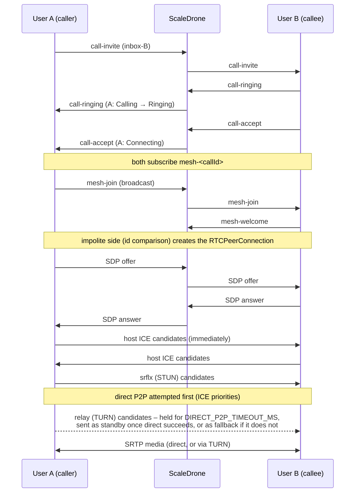
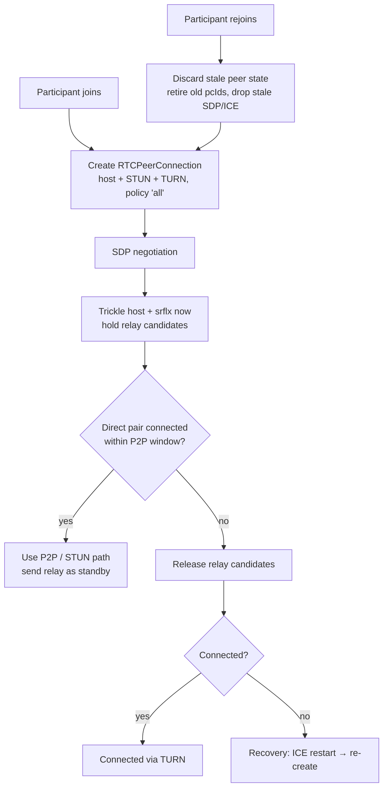

# MeshCall – P2P-first WebRTC mesh calling



A browser VoIP and video app built with Vite, TypeScript, WebRTC and ScaleDrone signaling. It supports:

- 1:1 audio and video calls
- group calls
- live streaming

It uses **mesh topology only**: there is no SFU, MCU or media server. Media always flows browser to browser. When direct connectivity is impossible, media goes through a TURN relay.

```bash
cp .env.example .env      # dev servers are pre-filled
npm install
npm run dev               # http://localhost:5173
npm run build             # type-check + production bundle in dist/
npm test                  # unit tests (vitest)
```

To test on phones or other PCs on your LAN, use `npm run dev:lan`. It serves over HTTPS with a self-signed certificate. HTTPS is required because camera, microphone, Service Worker and Push all need a secure context.

---

## Contents

0. [Rooms, layouts, 1:1 → group, live audience](#rooms-layouts-11--group-live-audience)
1. [Architecture](#architecture)
2. [Mesh topology](#mesh-topology)
3. [Signaling](#signaling-scaledrone)
4. [Presence](#presence)
5. [1:1 call flow](#11-call-flow)
6. [Group call flow](#group-call-flow)
7. [Live stream](#live-stream)
8. [P2P-first strategy, STUN and TURN fallback](#p2p-first-strategy)
9. [Join and rejoin behaviour](#join--rejoin-behaviour)
10. [ICE restart and recovery](#ice-restart--recovery)
11. [Perfect Negotiation](#perfect-negotiation)
12. [Push notifications and Service Worker](#push-notifications--service-worker)
13. [Data usage and bandwidth monitoring](#data-usage--bandwidth-monitoring)
14. [Weak network handling](#weak-network-handling)
15. [Direct messages and offline users](#direct-messages-and-offline-users)
16. [In-call chat, Picture-in-Picture and fullscreen](#in-call-chat-picture-in-picture-and-fullscreen)
17. [Diagnostics: TURN, STUN and WebRTC debugging](#diagnostics--turn--stun--webrtc-debugging)
18. [Configuration and security](#configuration--security)
19. [Browser limitations](#browser-limitations)
20. [Mesh scalability limitations](#mesh-scalability-limitations)
21. [Testing](#testing)

More detail:

- [`docs/WEBRTC_EXPLAINED.md`](docs/WEBRTC_EXPLAINED.md) walks through every flow step by step: who sends what, when, and what happens on late, duplicate or lost messages.
- [`docs/SELF_AUDIT.md`](docs/SELF_AUDIT.md) lists the issues found during the final audit, each with its root cause, impact and fix.

---

## Rooms, layouts, 1:1 → group, live audience

### Rooms

- **A page load asks for a room unless a room was active when the app was closed**, in which case that room is reopened (see *Reopening the last room* below). Recently used names are offered as chips that only fill the input; you still have to press Join. A notification click may prefill the room (`?room=`), but still needs Join.
- **Validation:** room names are trimmed, internal whitespace is collapsed, and Unicode is NFKC-normalised. They must be at most 64 characters, using only letters, digits, spaces and `- _ . '`.
- **`roomId`:** the lower-cased, dash-joined name, e.g. "Engineering Team" → `engineering-team`. It is stamped on every signaling message.
- **`roomKey`:** a 64-bit FNV hash of the `roomId`, used to build ScaleDrone room names: `observable-room-<key>` and `inbox-<key>-<deviceId>`.
- **Identity:** always the `deviceId`, never the room or display name.
- **Isolation, in two layers:**
  1. Each room uses different ScaleDrone rooms.
  2. `SignalingService` drops every incoming message whose `roomId` isn't the current room. Protocol v2 requires `roomId`, so v1 clients are ignored.

  Calls are further isolated by `callId`, and streams by `streamId` (the stream's `callId`).
- **Lifecycle:**



The top bar shows **Room: name**, with **Copy** (copies only the name, never any credential) and **Leave**.


**Reopening the last room:**

- **Close or reload while in a room:** the next launch rejoins that room automatically, using the normal join path. If the join fails, the room screen shows the error with the room prefilled.
- **Clicking Leave room:** clears the saved room, so the next launch asks *"Which room do you want to join?"* again.
- **Switching rooms:** joining a new room saves it instead.

A notification launch, or a `?room=` link, still takes priority and only prefills its room. The saved room is stored under `localStorage` key `voip.activeRoom`, and holds the room name only.

### Call layouts

`CallLayoutManager` (`src/ui/layout/`) is pure logic. It turns the tiles, the pinned participant and the active speaker into a `LayoutPlan`: the main tile(s), the strip order, and the effective layout. `VideoGrid` renders that plan by *moving* the existing tiles between the main area and the strip. Switching layout never touches an `RTCPeerConnection`, `MediaStream`, SDP or ICE; the e2e test verifies that the same `pcId` and the same `<video>` element survive, and that media keeps flowing.

| Layout | Desktop / tablet | Phone |
|---|---|---|
| Grid | responsive equal tiles | 1 or 2 columns |
| Speaker | active speaker large + equal row | main + horizontal strip |
| Spotlight | one person full size + small chips | same |
| Sidebar | main + vertical column | main + **horizontal** strip |
| Filmstrip | main + scrollable thumbnails | same |

- **Main participant, in priority order:** pinned (click a tile; click again to unpin) → active speaker (Speaker layout) → screen share → active speaker → first remote with video → you. The same participant is the PiP target.
- **Active speaker:** detected from `RTCRtpReceiver.getSynchronizationSources().audioLevel`, read about 4×/s. There is no WebAudio pipeline. EWMA smoothing, a sustained lead of 0.9 s at 1.5× loudness, and a minimum 2.5 s dwell prevent flicker.
- **Picker:** the Layout control (on phones: More → Layout) opens a picker, which becomes a bottom sheet on phones. The choice is saved as a per-device preference.

### Adding people to a call (1:1 → group)



- **Who may add:** any current participant, through **Add** (desktop) or **More → Add** (phones). Receivers accept `call-participants-added` only from a participant of that exact call.
- **Group access policy:** participants + invitees + joiners vouched for by an allowed participant (`invitedBy`). Welcomes (replies to our own join) are trusted. The e2e verifies that a forged add or join from a non-participant gets no connection.
- **Duplicates:** people already in the call or already invited are skipped.
- **Unanswered invites:** declines, busy, no answer and offline each produce a toast. The call itself is never affected.
- **Rejects:** only the host can reject a joiner, so a race between two simultaneous invitees can't break the call.
- **Mesh cap:** 6 participants.
- **Rejoin:** a participant who reloads rejoins with a fresh `RTCPeerConnection`, so P2P is attempted again.

### Live-stream audience

- **Go live** asks *Who can watch?*: **Everyone** in the room, or **Selected participants** from a room checklist.
- **Enforcement:** the audience is enforced inside the broadcaster's mesh (the `authorize` callback), on every join *and* every negotiation message. An unselected user never gets an `RTCPeerConnection`, so the media is never sent to them; the video element isn't merely hidden. A forced join by an unselected user is refused (e2e).
- **Manage audience** (while live):
  - A removed viewer's connection is closed (media stops immediately), and they are barred from reconnecting.
  - An added viewer is invited and connects P2P-first.
  - Nobody else's connection is touched.
- **Audience panel:** shows each person as *Streaming / Connecting / Can watch / Invited / Not selected / Disconnected*, with the **measured upload per viewer** and the total, taken from WebRTC transport stats, not estimated.
- **Signaling:**

| Message | Direction |
|---|---|
| `live-started` (+ heartbeat) | lobby |
| `live-audience-updated` | lobby |
| `live-stopped` | lobby |
| `live-viewer-added` | streamer → viewer inbox |
| `live-viewer-removed` | streamer → viewer inbox |
| `live-viewer-joined` | viewer → streamer |
| `live-viewer-left` | viewer → streamer (also sent on page unload, so the upload slot is freed immediately) |

  All of them carry `roomId`, `callId` = `streamId`, `senderId`, `messageId` and `timestamp`, plus `targetUserId` where it applies. Audience-changing messages are accepted only from the stream's own streamer.
- **Signaling confidentiality:** ScaleDrone without JWT is not confidential, so stream titles and allowed ids are visible to room members. The access control applies to the **media**.
- **Viewer reconnect:** the viewer is re-authorised on join. Allowed viewers get a fresh P2P-first connection; revoked viewers are refused.

## Architecture

```
src/
├── main.ts                     bootstrap (onboarding → services → UI)
├── app.ts                      composition root (creates + wires every service)
├── config.ts                   env-driven config, ICE servers (no secrets in code)
├── core/                       logger, typed emitter, async helpers, storage, formatting
├── types/                      signaling protocol, call/peer state, ScaleDrone typings
├── services/
│   ├── IdentityService         persistent deviceId + display name, per-load sessionId
│   ├── SignalingService        ScaleDrone transport, dedupe, outbox, liveness watchdog
│   ├── PresenceService         online/offline/connecting/unknown via observable lobby
│   ├── NetworkMonitor          online/offline, connection type, sleep/wake, resume
│   ├── NotificationService     in-app system notifications + SW click bridge
│   ├── PushNotificationService Web Push lifecycle against the existing push backend (src/push/)
│   ├── RoomService             room-name validation/normalisation, roomId + roomKey
│   ├── ChatService             call-scoped text chat over the mesh room (dedupe, ordering, unread)
│   ├── SettingsService         quality, devices, ICE test mode
│   └── Ringtone                WebAudio ring/ringback
├── media/
│   ├── MediaManager            getUserMedia, mute, camera, screen share, device swap
│   ├── DeviceManager           enumerateDevices, hot-plug, permission changes
│   └── QualityPresets          Low/360p/480p/720p/1080p + audio bitrates
├── webrtc/
│   ├── WebRTCManager           RTCPeerConnection factory (P2P-first config)
│   ├── PeerSession             one RTCPeerConnection: Perfect Negotiation, ICE queueing
│   ├── PeerConnectionManager   sessions per remote, rejoin/recreate, stale-message filter
│   ├── IceStrategy             candidate gate (P2P window) + path classification
│   ├── ConnectionRecoveryManager  disconnected/failed → ICE restart → recreate
│   ├── StatsMonitor/StatsParser   getStats() polling and parsing (selected pair = truth)
│   ├── DataUsageMonitor        per-call byte accounting across reconnects
│   ├── AdaptiveLadder/AdaptiveQualityManager  hysteresis-based video adaptation
│   ├── IceServerProbe          STUN/TURN health check
│   └── ActiveSpeaker           audio-level (getSynchronizationSources) speaker detection + hysteresis
├── calls/
│   ├── CallManager             call state machine, invites, accept/reject/hangup, rejoin
│   ├── CallStateMachine        allowed status transitions
│   ├── MeshSession             membership protocol + wiring for one call/stream
│   ├── GroupCallManager        create/add/remove/leave
│   └── LiveStreamManager       go live, discovery, viewer cap
└── ui/                         UIManager + views (grid, call, chat, sidebar, dialogs, diagnostics)
    ├── layout/CallLayoutManager  grid · speaker · spotlight · sidebar · filmstrip (pure logic)
    ├── views/RoomScreen        "Join a Room" – shown on every page load
    ├── ViewModeController      Picture-in-Picture + Fullscreen, synced with the browser APIs
    └── views/ChatPanel         chat list + composer (Enter = send, Shift+Enter = newline)
public/sw.js                    Service Worker (push → notification → open/focus app)
```



The design follows three rules:

- **Call state is separate from DOM state.** Services hold plain data such as `CallState`, `ParticipantState` and `PeerConnectionState`. The UI reads that data and never stores call logic.
- **Signaling state is separate from WebRTC state.** `SignalingService` status, call status and per-peer `RTCPeerConnection` state are independent. For example, a signaling outage does not end a call whose media is still flowing.
- **Each module has one responsibility.** Dependencies are injected in `app.ts`.

## Mesh topology

```
 1:1                      Group (3)                     Live (broadcaster B)
 A ◀────▶ B                   A                          B ──▶ V1
                            ╱   ╲                        B ──▶ V2
                           B ─── C                       B ──▶ V3
```

Each participant keeps one `RTCPeerConnection` per remote participant, so a group of N has N·(N−1)/2 links. In a live stream only broadcaster↔viewer links exist. Viewers never connect to each other.

## Signaling (ScaleDrone)

The app uses channel `EoIG3R1I4JdyS4L1`, configurable with `VITE_SCALEDRONE_CHANNEL_ID`.

| Room | Purpose |
|---|---|
| `observable-room-<roomKey>` | room presence (ScaleDrone member list), heartbeats, live-stream announcements |
| `inbox-<roomKey>-<deviceId>` | directed messages within the room: invites, SDP, ICE, welcome, reject… |
| `mesh-<callId>` | broadcast within a call: join, leave, heartbeat, media state, **chat messages** |

Every message is a typed envelope (`src/types/signaling.ts`) containing:

- `messageId`: used for de-duplication (a bounded LRU set)
- `timestamp`
- `messageType`
- `senderId` and `receiverId`: persistent device IDs, never display names
- `senderSessionId`: changes on every reload, so reloads can be recognised as rejoins
- `roomId`: the room scope; messages from any other room are dropped on receipt
- `callId`
- `peerId`: the sender's `RTCPeerConnection` id for negotiation messages
- `payload`

Negotiation messages also carry `pcId` and `targetPcId`. These let a peer discard SDP and ICE addressed to a connection that has since been replaced.

`SignalingService` has four robustness features:

- **Validation:** messages are structurally validated, and our own echoes are filtered out.
- **Outbox:** messages are queued while disconnected and flushed on reconnect. Anything older than 20 s is dropped.
- **Reconnect:** ScaleDrone's own auto-reconnect handles most drops. If ScaleDrone gives up, the client is re-created with exponential backoff.
- **Liveness watchdog:** ScaleDrone echoes our publishes back to us. If a publish is not echoed within 20 s, the socket is presumed dead and the client is re-created. This catches Wi-Fi changes and sleep, where a WebSocket often never errors.

## Presence

Presence uses the ScaleDrone *observable* lobby. Its member list and join/leave events are authoritative. Heartbeats every 20 s carry the display name, a busy flag and push capability.

| State | Meaning |
|---|---|
| **Online** | device has a session in the lobby, or it heartbeated recently |
| **Offline** | left, after a 10 s grace period, so a reload does not flash "Offline" |
| **Connecting** | our own signaling is connecting |
| **Unknown** | our own signaling is down, so we can't observe anyone |

A single missed heartbeat never marks a user offline. On `pagehide` the app sends a best-effort `presence-leave`, which makes a tab close show as offline immediately. Known users are kept in `localStorage`, so offline users still appear in the list.

## 1:1 call flow



Call statuses are Idle, Calling, Ringing, Connecting, Connected, Reconnecting, Ended, Failed, Rejected and Busy. Transitions are validated by `CallStateMachine`, and each status has its own UI. Every waiting state has a timeout, so the user is never left on a permanent spinner:

| Waiting state | Timeout |
|---|---|
| ringing | 45 s |
| no ringing ack from an offline callee | 8 s |
| accept → connect | 25 s |
| reconnecting | 45 s |

## Group call flow

1. The host creates the call, joins `mesh-<callId>`, and sends `call-invite` to each selected user.
2. Each invitee accepts and broadcasts `mesh-join`. Existing members reply with `mesh-welcome`.
3. For each pair, the **impolite** peer creates the connection and sends the offer.
4. Every member heartbeats every 10 s. The heartbeat carries its role, media state, and its `pcId` for every peer. This heals missed joins and detects orphaned one-sided connections.
5. **Leave:** the member broadcasts `mesh-leave`, and peers close only that member's connection.
6. **Remove participant:** the host broadcasts `mesh-remove`. The target leaves and is barred from rejoining.
7. **Add participant:** sends a new `call-invite` for the same `callId`.

The group is capped at `mesh.maxParticipants` (6), and the host enforces the cap.

## Live stream

The broadcaster joins as `broadcaster` and announces the stream in the lobby every 15 s. Viewers join as `viewer`:

- Transceivers are `sendonly` on the broadcaster and `recvonly` on viewers.
- Only broadcaster↔viewer links are created.
- When the broadcaster leaves, viewers see **Stream ended**.
- Viewers are capped at `mesh.maxLiveViewers` (8) and are rejected with `mesh-reject: full` beyond that.

> **Mesh bandwidth warning:** there is no media server, so the broadcaster uploads one full copy of its stream per viewer. At 1 Mbps and 8 viewers that is about 8 Mbps of upstream. The UI shows this warning before going live.


### Calling someone into a live stream

While you are live, **Call** (in the sidebar, or the phone button next to a viewer in the audience panel) invites that person into the stream instead of starting a separate call. If the audience is *Selected*, they are added to it. They then join as a normal viewer, so the WebRTC and live-stream path is unchanged.

- **Online:** they get a ringing invitation (the *Incoming live stream call* dialog) and the incoming-call ringtone until they choose **Watch** or **Not now**, or the ring timeout passes. A system notification is also shown if their tab is hidden.
- **Offline or unknown:** a **targeted** `incoming-call` push with `callType: 'live'` goes to that person only, through `PushNotificationService.notifyIncomingCall`. It is never broadcast. The current backend can't target a device, so no push is sent: the streamer is told so, and the person is rung **as soon as they come online** in the room within the ring window. Once the backend supports `POST /notify`, the push is sent with no other changes. Its notification reads *Live Stream Invitation — Host invites you to watch “Title” in Room*.

## P2P-first strategy

The strategy has two layers. Neither uses an arbitrary delay to hide a race.

**1. Native ICE prioritisation**

Configuration: `iceTransportPolicy: "all"`, `bundlePolicy: "max-bundle"`, `iceCandidatePoolSize: 2`.

RFC 8445 type preferences rank host (126) above prflx (110) above srflx (100) above relay (0). As a result, a working direct pair always outranks a relayed one. SDP priorities are **not** munged, because the browser defaults already express "direct first". Relay-only mode is never used in the normal flow.

**2. `CandidateGate`: the P2P window** (`src/webrtc/IceStrategy.ts`)

- Host and srflx candidates are trickled immediately.
- Local **relay** candidates are still gathered in parallel, so a TURN allocation is ready with no extra latency if it is needed. However, they are **held back** from the remote peer until one of these happens:
  - direct connectivity succeeds; the relay candidates are then sent as a *standby* fallback path;
  - `DIRECT_P2P_TIMEOUT_MS` (default 3000) elapses without a connection;
  - ICE reports `disconnected` or `failed`;
  - gathering finished and no non-relay candidate exists at all.
- An optional `HOST_ONLY_WINDOW_MS` also holds srflx candidates, giving host↔host (LAN) pairs a head start. It defaults to 0 because ICE priorities already prefer host pairs, so delaying srflx only slows down calls between different networks.
- The gate **never tears anything down**. It only decides *when* fallback candidates become available. A connection that is making progress is never interrupted.
- The gate is **re-armed on every new ICE generation**: a fresh connection, any ICE restart, or a rejoin. Each of these therefore gives direct P2P a new head start.

```
Peer connection ─┬─ host ↔ host ............................ P2P (LAN)
                 ├─ srflx involved (STUN-discovered NAT path) STUN (media still direct)
                 └─ relay (after the P2P window / failure) .. TURN
```

The chosen path is **never inferred from configuration**. `StatsMonitor` reads `getStats()` to find it:

1. Take `transport.selectedCandidatePairId`. Browsers without it fall back to `candidate-pair.selected`, or to a nominated and succeeded pair.
2. From that pair, read `local-candidate.candidateType` and `remote-candidate.candidateType`.
3. Classify the path with `classifyPath()`:
   - either side `relay` → **TURN**
   - `host → host`, or `prflx` between private addresses → **P2P**
   - otherwise → **STUN**

"TURN is required" is **never cached**. Every new connection, rejoin or ICE restart starts over at "direct first".

STUN always tries Google's public STUN servers first, then `stun:aahlaad.in:3478` (see `orderStunUrls` in `src/config.ts`). Google's servers are STUN only; Google offers no public TURN. The TURN relay fallback is `turn:aahlaad.in:3478`. All of these are configurable.

## Join and rejoin behaviour



| Situation | What happens |
|---|---|
| Remote **reloads** (new `sessionId`) | Its old connection is closed and its old `pcId` retired. A brand-new `RTCPeerConnection` is created, so P2P is tried first again. |
| Remote **re-announces** with the same session (its signaling reconnected, and its network may have changed) | ICE restart on *that link only*. Other participants are untouched. |
| Offer arrives from a new remote `pcId` | The remote re-created its side, so a fresh connection is built here too. |
| SDP or ICE from a **retired** `pcId`, or addressed to one of our old `pcId`s | Dropped. |
| We reload during a call | A **Rejoin** banner appears. The saved call is kept in `sessionStorage` for 15 min. Rejoining is a fresh negotiation with everyone. |

## ICE restart and recovery

`ConnectionRecoveryManager` applies this policy per peer:

| Trigger | Action |
|---|---|
| `connected` | reset attempts |
| `disconnected` | wait 3 s (ICE often self-heals), then ICE restart |
| `failed` | ICE restart immediately |
| restart did not reconnect in time (10 s, 20 s, 30 s…) | ICE restart again |
| more than `maxIceRestarts` (3) restarts | re-create the `RTCPeerConnection` (full renegotiation); a circuit breaker allows at most 4 per peer per minute |
| negotiation stalled (offer re-sent twice, no answer) | re-create |
| browser **offline** | pause; attempts are not consumed |
| `online` / connection-type change / wake from sleep | ICE restart on **every** peer, because the path may be stale and direct P2P should be tried again |
| tab resumed after being hidden > 30 s / bfcache restore | ICE restart on unhealthy peers |
| signaling reconnected | re-announce in the mesh; restart unhealthy peers (a lost offer is re-sent by the negotiation watchdog) |

`navigator.onLine` is only a **hint**. It triggers re-validation and is never treated as proof that WebRTC works.

`pc.restartIce()` produces new ICE credentials. That means fresh gathering, a re-armed P2P window, and host candidates first again. ICE restart is make-before-break, so media keeps flowing on the old pair until a new pair is selected.

## Perfect Negotiation

`PeerSession` implements the W3C pattern:

- **Deterministic roles:** `polite = "${deviceId}|${sessionId}" > remote's`. Exactly one side of each pair is polite, even for two tabs on the same device.
- **Collision detection:** uses `makingOffer`, `ignoreOffer` and `isSettingRemoteAnswerPending`. The polite peer rolls back its own offer (implicit rollback). The impolite peer ignores the colliding offer.
- **Serial processing:** all incoming SDP and ICE for a peer is processed through a `SerialQueue`, so operations never interleave.
- **Stale answers:** an answer received while not in `have-local-offer` is a stale or duplicate answer and is ignored.
- **Initial offer:** only the impolite peer makes it, so a normal join never produces glare. Perfect Negotiation still covers later collisions, such as simultaneous ICE restarts, simultaneous re-creation, or a join during renegotiation.
- **Candidate queueing:** candidates that arrive before their SDP are queued per remote `pcId`. The same applies to a future ICE generation, detected when its `usernameFragment` differs. Queued candidates are applied after `setRemoteDescription`. Duplicates are de-duplicated by (ufrag, mid, candidate). A failing `addIceCandidate` is caught and never breaks the connection.
- **Lost messages:** a lost offer or answer is re-sent by a watchdog, and then escalated to re-creation.

## Install as an app, offline shell and updates

- **Installable app (PWA):** a web app manifest provides the name, `standalone` display, theme colours, 192/512 px PNG icons, a maskable icon and an Apple touch icon. Together with the Service Worker this meets Chrome's install criteria; the e2e test asserts zero installability errors.
  - **Chromium desktop and Android:** the app captures `beforeinstallprompt` and shows its own **Install** button (sidebar, idle screen, Settings → App).
  - **iOS/iPadOS:** there is no install API, so **Install** opens a *Share → Add to Home Screen* guide.
  - Installed state is detected (`display-mode: standalone`), and the button disappears.
- **Service Worker (`public/sw.js`):**
  - It is registered at boot, before the name screen, and scoped to the app's base path (works under `/meshcall/` on GitHub Pages).
  - At build time a small Vite plugin stamps `sw.js` with a unique `BUILD_ID` and the exact list of emitted files, so each release precaches its own hashed JS/CSS, HTML, icons and manifest.
  - Pages are network-first (4 s), falling back to the cached shell, then to an offline page.
  - Hashed assets are cache-first.
  - Cross-origin requests (ScaleDrone, the push relay) are never intercepted.
  - In `vite dev` it runs in pass-through mode, so HMR is unaffected.
- **Offline:** the installed app still opens without a network (you get the room screen, with signaling "unavailable"). When the network returns, signaling reconnects by itself.
- **Updates never interrupt a call:**
  - A new release installs in the background and **waits**.
  - The app shows *"A new version of MeshCall is available [Reload]"*, and asks for confirmation during a call.
  - It checks for updates every 30 min and whenever the app returns to the foreground.

## Push notifications

MeshCall uses the **existing push backend `https://web-push-3zaz.onrender.com`**. Override it with `VITE_PUSH_SERVER_URL`; its code default is `PUSH_SERVER_URL` in `src/config.ts`. The frontend implements exactly its API:

| Endpoint | Used for |
|---|---|
| `GET /vapid` | VAPID **public** key (validated: 65-byte P-256 point; never cached if invalid) |
| `POST /subscribe` | the browser's `PushSubscription.toJSON()`, unchanged |
| `POST /isPushSubscribed` `{endpoint}` | startup verification, keeping the UI in sync |
| `POST /unsubscribe` `{endpoint}` | turning notifications off (a 404 counts as already gone) |
| `POST /notifyAll` | **development-only** test button; never used for calls |

### Architecture

- **Code layout:**
  - `src/push/PushBackend.ts` is a backend adapter; `WebPushServerBackend` implements the contract above.
  - `src/push/payloads.ts` defines the typed payloads (`PushNotificationType`, `IncomingCallPush`, `CallLaunchContext`).
  - `src/push/base64url.ts` converts Base64URL to a `Uint8Array`.
  - `src/services/PushNotificationService.ts` provides `initialize`, `getPermissionState`, `requestPermission`, `getSubscription`, `subscribe`, `unsubscribe`, `isSubscribed`, `refreshSubscription`, `notifyIncomingCall` and `diagnostics`.
- **Source of truth:** `pushManager.getSubscription()`. `localStorage` only remembers that the user *wanted* push.
- **Startup:**
  1. Wait for the Service Worker, then call `getSubscription()`.
  2. `POST /isPushSubscribed`, and re-register if the server lost the subscription.
  3. If the subscription was created with an old VAPID key, re-subscribe.
  4. If it expired while the user wants push, recreate it.
  5. Transient backend errors are retried at 5 s, 20 s and 60 s, and again on `online` and on `pushsubscriptionchange`.
- **Permission is only requested from a click:** Settings → Notifications → **Incoming calls** switch, or the idle-screen **Enable Notifications** card. When the browser has denied it, the app shows per-browser unblock instructions and never re-prompts.
- **States:** Enabled / Disabled / Connecting / Blocked by browser / Unavailable (with the reason). They appear in Settings and in Diagnostics → Push Notifications. The diagnostics show support, permission, SW state, the subscription and server confirmation, a redacted endpoint, the server URL, the last registration, and targeting capability. Subscription keys are never shown or logged.

### Targeted delivery (calls, private messages)

The backend (`aquibahmed21/web-push`) was extended with targeted delivery:

```text
POST /subscribe  { ...PushSubscription.toJSON(), deviceId }     subscription + this MeshCall device id
                                                                (re-registering a known endpoint attaches/updates the id)
POST /notify     { targetDeviceId, title, body, data, ttl }     push ONLY to that device's subscriptions
                 → 200 {successes, failures} | 404 {error} no subscription for the device
payload delivered = { title, body, data }   data = incoming-call | chat-message payload (see src/push/payloads.ts)
```

- **Senders:**
  - An **incoming call** to someone who is not online sends `POST /notify`. This includes direct calls, group invites and live-stream invitations.
  - A **private message** to an offline user sends `POST /notify` too.
  - The caller does not need push enabled; only the recipient does.
  - `/notifyAll` is never used for calls or messages.
- **Results:**
  - `accepted`: the push server took it, which is not proof of delivery.
  - `not-subscribed` (404 JSON): the recipient never enabled notifications. The call ends with *"X is offline and hasn't enabled call notifications"*, and a message stays queued.
  - `unsupported`: an HTML 404 means a server without `/notify`.
- **Existing subscriptions** get their `deviceId` attached automatically: the app re-registers idempotently on every start.
- **Known backend limitations** (not changed here):
  - `/notify` is unauthenticated, so anyone who knows a device id can send it a notification. Add auth, for example a signed token, and rate limiting before wider use.
  - Subscriptions live in `notifications.json` on Render's ephemeral disk, and are lost on restart or redeploy until each device opens MeshCall again. Use a persistent store.
  - The VAPID **private** key is committed in `notifications.json`. Move the keys to environment variables. Rotating them invalidates every subscription.

### Service Worker (`public/sw.js`)

- **Registration:** at `${BASE_URL}sw.js` with scope `${BASE_URL}`, i.e. `/meshcall/` on GitHub Pages. This is verified by the e2e test.
- **`push`:** payloads are parsed defensively:
  - `incoming-call` → *"Incoming Video Call — Alice is calling you in Engineering"*, with an **Open MeshCall** action;
  - `{title, body}` and `{notification:{…}}` (the `/notifyAll` style) → a generic notification;
  - plain text → a generic notification;
  - a malformed payload → a generic notification. The worker never crashes.
- **Visible app:** if MeshCall is visible, the worker posts the call to the page instead of notifying, so there is no duplicate.
- **`notificationclick`:**
  - The notification is closed, and the worker focuses an existing MeshCall window and `postMessage`s the call context.
  - If no window exists, it stores the context in a short-lived Cache entry and opens `/meshcall/`. **No call data goes in the URL.**
  - The app reads the context once, asks for or switches to the call's room, and then the call rings with the normal **Accept / Reject** dialog. **Nothing is auto-accepted.**
- **`notificationclose`:** dismissing is not declining; the page is informed.
- **`pushsubscriptionchange`:** the page re-registers the new subscription.

**Limitation:** a Service Worker cannot hold a WebRTC call. Push only shows the notification. The chain is: user opens MeshCall → app starts → ScaleDrone connects → room joined → the caller re-sends the invite → WebRTC negotiation.

**CORS:** the backend allows `https://aquibahmed21.github.io` and `http://localhost:5173` (verified). Any other deployment origin must be added to the backend's CORS configuration. The frontend never tries to bypass CORS.

## Direct messages and offline users

**Buttons are never disabled because someone is offline.** Every person in the room keeps **Audio call**, **Video call** and **Message**.

**Calling a user who is not online** (offline, or presence unknown) never starts a blind WebRTC attempt. Instead a dialog says *"John is currently offline"* (or that the status is unknown):

- **Send Call Notification** appears only when targeted push is actually available and the recipient is known to have push enabled. That is not the case with the current backend.
- Otherwise the dialog explains why no notification can be sent and offers **Message instead** or **Cancel**.

**Direct messages** (`src/services/DirectMessageService.ts`, `ConversationDrawer`) are 1:1 conversations, available in and outside calls:

| Recipient presence | Delivery |
|---|---|
| **online** | ScaleDrone, to the recipient's room inbox → the recipient's app sends `direct-message-ack` → **Delivered** |
| offline / **unknown** (unknown is never treated as online) | `PushNotificationService.sendToUser()`, a **targeted** push; never `/notifyAll` |
| … with the current backend (`'unsupported'`) | **Waiting for recipient**: queued on this device with an explanation, and sent through ScaleDrone automatically when the recipient comes online |

- **Message states:**
  - Sending / Sent (published, no ack yet) / **Delivered** (the recipient's app acknowledged it);
  - Waiting for recipient;
  - **Push request accepted**: the push server accepted the request, which is *not* shown as Delivered;
  - Failed.
- **No duplicates:** a sent message with no ack within 15 s goes back to *Waiting*. Retries reuse the `messageId`; the recipient de-duplicates but always acks, so a lost ack never creates a duplicate.
- **Acks** are only accepted from the recipient.
- **Unread counts** appear as a badge on the Message button. An in-app toast offers **Open**. A system notification (tag `dm-<sender>`) is shown only when the tab is hidden or unfocused.
- **Room isolation:** conversations are stored per `roomId` (`voip.dm.<roomId>`). Signaling already drops other rooms' messages, and persisted entries are filtered by `roomId` again when loaded.
- **Security:** text is always rendered with `textContent` and limited to 2,000 characters.

**Chat notification click:** the Service Worker handles `chat-message` pushes. If the app is visible it posts to the page and shows no system notification. Otherwise it shows *"New message from Alice"*. A click focuses or opens MeshCall and hands the context over by `postMessage`, or by a one-time Cache entry. **The URL never carries message data.** The app then:

1. enters or offers the correct room;
2. opens the conversation and highlights the message;
3. closes the notification.

### Backend changes required for targeted push (not implemented – the backend is not modified here)

The current backend stores bare subscriptions and can only broadcast. Delivering calls and messages to *one* offline user needs:

```text
POST /subscribe   { subscription, deviceId }         associate a subscription with a MeshCall device (+ auth)
POST /notify      { targetDeviceId, title, body, data }   deliver to that device's subscriptions only
      data = { type:'incoming-call', callId, roomId, roomName, callerId, callerName, callType, timestamp, expiresAt }
           | { type:'chat-message', messageId, senderId, senderName, text, roomId, roomName, timestamp }
      → 202 {accepted:true} | 404 {error:'no subscription for device'} | 401/403
```

- **Authentication:** the sender must be authenticated, for example with the same JWT as ScaleDrone, and rate-limited, so nobody can push to arbitrary devices.
- **Response:** `/notify` should also return whether the device has a subscription, so the UI can show *push enabled* reliably.
- **Frontend change:** a `PushBackend` adapter with `capabilities.targetedDelivery = true`. `sendToUser`, the call dialog and messaging then work without other changes.
- **Current frontend behaviour:** because the backend does not have this, the frontend shows no "push enabled" badge (it is not reliably known) and returns `'unsupported'` from `sendToUser`.

## Data usage and bandwidth monitoring

The scope is the **current call**. It resets when a call starts and survives reconnects.

- **Source of truth per peer:** `RTCTransportStats.bytesSent` and `bytesReceived`. These count everything on the bundled transport: RTP, RTCP, DTLS and STUN. Where transport stats don't exist (Firefox), the app sums candidate-pair bytes instead. Each packet travels on exactly one pair, so the sum does not double-count.
- **One report per peer per tick:** the app never adds RTP-level bytes on top of transport bytes. `pc.getStats()` is a superset of `RTCRtpSender.getStats()` and `RTCRtpReceiver.getStats()`, so calling all of them would double-count.
- **Counter resets:** counters restart at 0 when an `RTCPeerConnection` is re-created. `DataUsageMonitor` accumulates positive deltas per `pcId`, so totals don't reset or double on a reconnect.
- **Displayed values:** My Upload (the sum across peers; in a mesh you upload to each peer separately), per-peer received, total received, and upload/download bitrate. Units are shown as KB/MB/GB and kbps/Mbps.

## Weak network handling

**Monitored metrics:** RTT, jitter, inbound and outbound packet loss, packets discarded, frames dropped, available outgoing and incoming bitrate, codec, quality limitation reason, and the selected pair.

**Quality classes:**

| Class | RTT | Loss | Jitter |
|---|---|---|---|
| Excellent | < 200 ms | < 2 % | < 40 ms |
| Good | < 400 ms | < 5 % | < 80 ms |
| Poor | < 800 ms | < 12 % | — |
| Critical | above that, or no bytes received for 3 samples | | |

RTT and loss are smoothed with an EWMA.

**Adaptation (`AdaptiveLadder`, in "Auto" mode):**

- Each peer has its own ladder: 180p → 360p → 480p → 720p. Each peer gets its own encoding, so one weak link does not degrade the others.
- **Down:** after 2 consecutive bad samples. Critical drops two steps.
- **Up:** only after 5 consecutive good samples, a minimum dwell of 8 s, and 1.3× bandwidth headroom for the next level.
- **Anti-oscillation:** an up-step followed quickly by a down-step doubles the up-cooldown, up to a maximum of 120 s.
- **Starting level:** depends on mesh size, because every extra peer costs another full upstream copy.
- **Mechanism:** changes are applied with `RTCRtpSender.setParameters()`, using `maxBitrate`, `scaleResolutionDownBy` and `maxFramerate`. There is never a renegotiation or a rebuilt connection.
- **Fixed presets:** Low, 360p, 480p, 720p and 1080p set fixed encodings and camera capture constraints.
- **Audio:** runs at a high sender priority. Audio bitrate presets are 16, 32 and 64 kbps.

## In-call chat, Picture-in-Picture and fullscreen

These features sit entirely in the UI and signaling layers. The ICE strategy, Perfect Negotiation, recovery logic and peer-connection lifecycle are unchanged.

### Chat

Chat goes over **ScaleDrone**, not a WebRTC DataChannel:

- Every participant is already subscribed to `mesh-<callId>`, so chat adds no subscription, no peer connection and no new failure mode to the media path.
- It also works for peers whose media is currently down (for example, a peer that is reconnecting).

Wire format: the standard signaling envelope with `messageType: "chat-message"` and `payload: { text }`. The envelope already carries `messageId`, `senderId`, `senderName`, `callId` and `timestamp`. `ChatService` maps it onto the domain type:

```ts
interface ChatMessage {
  type: 'chat-message';
  messageId: string;      // uuid, unique per message (a retry re-uses it)
  senderId: string;       // persistent deviceId
  senderName: string;
  receiverId?: string;    // unset = everyone in the call
  callId?: string;        // isolates the conversation
  text: string;           // trimmed, ≤ 2000 chars
  timestamp: number;
}
```

- **Isolation:** `ChatService` is bound to one `callId`. A message carrying any other `callId`, or arriving while no call is bound, is ignored. Chat is bound while the call is *connecting*, *connected* or *reconnecting*, so a WebRTC outage does **not** clear it. It is cleared once the call ends (messages, unread count and processed ids), so the next call always starts clean.
- **De-duplication and ordering:** `processedMessageIds` means each message is shown once. Messages are kept sorted by `(timestamp, messageId)`, so out-of-order arrival is fine. Ordering is by the sender's clock, so small clock skew between devices can reorder near-simultaneous messages.
- **Delivery:** our own message appears immediately as *Sending…*. It flips to sent when ScaleDrone echoes our publish back. With no echo within 12 s it becomes *Not delivered · Retry*. A retry uses the same `messageId`, so peers that already received it drop the duplicate.
- **Composer:**
  - **Enter** sends; **Shift+Enter** inserts a newline; IME composition is respected.
  - Empty or whitespace-only messages are not sent.
  - Identical text submitted twice within 0.8 s is treated as an accidental double send.
  - While signaling is down, input is disabled with the placeholder *Connecting…* or *Messaging unavailable*.
- **Unread count:** while the chat panel is closed, the **Chat** control shows a badge such as `Chat (2)`. Opening the chat clears it. Your own messages never count.
- **No history:** there is no backend. A participant who reloads starts with an empty chat, while the others keep theirs.

### Picture-in-Picture

- The **Enter PiP / Exit PiP** control, and a PiP button on each tile, use `HTMLVideoElement.requestPictureInPicture()` on the **existing tile `<video>`**. No second stream is created.
- **What PiP shows:** the *main participant*. That is the tile you clicked (outlined); otherwise a screen share, otherwise the first remote participant with video, otherwise your own video. Selecting another tile while PiP is open moves PiP to it.
- **If the PiP participant leaves:** PiP follows the new main participant if that tile has video; otherwise the browser closes it.
- **UI state is re-read from the browser:** `document.pictureInPictureElement` is checked on each `enterpictureinpicture` and `leavepictureinpicture` event. Closing the PiP window yourself therefore resets the button to *Enter PiP*.
- **Call end:** PiP is exited immediately.
- **States:** `inactive | entering | active | exiting | unsupported | error`.
- **Unsupported browsers:** the control is hidden, as in Firefox, which has only its own built-in PiP toggle.

### Fullscreen

- `requestFullscreen()` targets the **call container** (video area, chat panel and controls), never the whole app.
- In fullscreen the grid switches to a **spotlight** layout: the main participant is large and the others form a filmstrip.
- Clicking a filmstrip tile switches the main participant. The controls and chat stay usable.
- **ESC** exits; the browser handles it natively, and the `fullscreenchange` event resynchronises the UI.
- `fullscreenerror` shows a toast. Fullscreen is exited when the call ends.
- **States:** `inactive | active | unsupported | error`.
- **Fullscreen → PiP** and **PiP → Fullscreen** both work where the browser allows them. Button labels are always derived from the browser's current state, so they can't show a conflicting state.

### Layout

| Width | Chat / participants |
|---|---|
| Desktop (> 1100 px) | right-hand column inside the call view: Users · Video · Chat |
| Tablet (≤ 1100 px) | drawer over the video; controls stay visible; secondary controls move into **More** |
| Phone (≤ 767 px) | Video → Controls → Participants/Chat stacked; while typing, the video shrinks to a strip. The app height follows `visualViewport`, and `interactive-widget=resizes-content` keeps the on-screen keyboard from covering the input. |

Chat and participants share one panel with tabs. On desktop, all controls are inline: Mute, Camera, Share, Chat, People, Invite, Fullscreen, PiP, Stats and End. On smaller screens the primary controls stay inline (Mute, Camera, Chat, More, End) and the rest are in the **More** menu.

## Diagnostics: TURN, STUN and WebRTC debugging

Open the **Diagnostics** panel with the chart icon in the top bar.

**Per-peer diagnostics:**

- Connection State, ICE State, Signaling State, Gathering
- **Connection Type: P2P / STUN / TURN**
- **Candidate Pair: e.g. `host → host`**
- **Transport** (UDP/TCP, plus the relay protocol to the TURN server)
- **Path** (for example "Direct P2P (host / LAN)")
- Local and remote addresses
- relay-candidate gate state
- local and remote candidate counts by type
- time to connect, ICE restarts
- RTT, loss, jitter, bitrates, available bandwidth, codecs, resolution/fps, frames dropped
- ICE errors

A **Retry direct P2P** button forces an ICE restart for that peer.

### Exact connection path per participant

The path is read from `RTCPeerConnection.getStats()` of each peer connection, **never inferred from the configured ICE servers**:

1. The selected pair is `transport.selectedCandidatePairId`. Firefox falls back to `selected`, and other browsers to the busiest `nominated` + `succeeded` pair.
2. Its `local-candidate` and `remote-candidate` give the candidate types, addresses, protocol, `relayProtocol` and `url`.
3. The pair is classified as `ConnectionPath = 'p2p' | 'stun' | 'turn' | 'unknown'`:

| Selected pair | Path | Meaning |
|---|---|---|
| `host → host` (or `prflx` between private addresses) | **P2P** | direct, same network |
| `srflx`/`prflx` on either side, no relay | **STUN** | direct P2P through NAT; STUN only discovered the address, media does not pass through it |
| `relay` on either side | **TURN** | media relayed through a TURN server |
| not connected / no selected pair yet | **Unknown** | never guessed |

The actual pair is always shown, for example `relay → srflx`.

**Which STUN/TURN server?** It is only shown when WebRTC reports it:

- the `url` of the *local* candidate in `getStats()`, which Chrome exposes for srflx and relay candidates (verified in e2e: `turn:<host>:3479?transport=udp via stats`);
- otherwise, the `url` of the `icecandidate` event that gathered that exact candidate (matched by type, address, port and protocol).

If neither is available, the UI says *"Relay/Server-reflexive candidate detected – the browser did not say which server"* and lists the configured servers, without picking one. When only the **remote** side is relayed or reflexive, the peer's own server is not visible from this side, and the UI says so.

**Tiles:** the compact line shows `● Connected · P2P` (or Connecting / Reconnecting / Failed · Unknown). The ⓘ button expands the details: Connection, ICE, Protocol, RTT, Packet Loss, Upload, Download and the TURN/STUN server.

**Network Diagnostics** (in the Diagnostics panel) lists every peer connection with the same data. It reuses the single stats poll: one `getStats()` per peer connection every `stats.intervalMs` (2 s). The panel and tiles add no extra calls, as the e2e test verifies. The interval stays at 2 s because the adaptive-quality hysteresis is tuned to it.

### Network / ICE diagnostics: STUN and TURN tests

Each configured URL is listed under **STUN Tests** or **TURN Tests**, with its own **Test** or **Test TURN** button and a **Test all** button. Each test:

- creates a **temporary** `RTCPeerConnection` configured with that one server;
- adds a data channel and calls `setLocalDescription()` to gather candidates;
- **STUN** succeeds only if an **srflx** candidate is gathered, and shows the public address;
- **TURN** uses `iceTransportPolicy: 'relay'` **for this test connection only**. It succeeds only if a **relay** candidate is allocated, and shows the relay address, candidate protocol, relay protocol (UDP/TCP/TLS) and, when exposed, the reported URL. "Gathering completed" alone never counts as success;
- on failure, maps `icecandidateerror` codes to a cause: 401/403 → invalid credentials; 7xx → unreachable or DNS; 486/508; otherwise the list of possible causes (server unreachable, invalid credentials, incorrect port, server configuration, firewall, TLS/UDP/TCP issue);
- always closes the connection (freeing sockets and the TURN allocation) and times out after 8 s.

Results use `IceServerTestResult` (`src/webrtc/IceServerProbe.ts`). Normal calls always keep `iceTransportPolicy: 'all'`.

**ICE test modes** (Settings → Advanced) apply only to new connections and reset on reload:

- *Force TURN relay* uses `iceTransportPolicy: "relay"` and proves the relay path works.
- *Disable TURN* proves direct connectivity on its own.

**Console:**

- `window.__voip.diagnostics()` returns every peer's selected pair, `connectionPath`, identified `server`, transport and counters as JSON.
- `window.__voip.probeIceServers()` tests every configured server.
- `window.__voip.testIceServer({ urls, username, credential })` tests any single server. Set Settings → Log level to `DEBUG` for detailed structured logs, such as `[ICE] Selected candidate pair = host → host`.

**Browser tools:** use `chrome://webrtc-internals` in Chrome or `about:webrtc` in Firefox for a raw view.

## Configuration and security

| Variable | Purpose |
|---|---|
| `VITE_SCALEDRONE_CHANNEL_ID` | ScaleDrone channel |
| `VITE_STUN_SERVER` | comma-separated STUN URLs |
| `VITE_TURN_SERVER`, `VITE_TURN_USERNAME`, `VITE_TURN_CREDENTIAL` | TURN relay |
| `VITE_DIRECT_P2P_TIMEOUT_MS` | P2P window before relay candidates are released (default 3000) |
| `VITE_HOST_ONLY_WINDOW_MS` | optional host-only head start (default 0) |
| `VITE_ICE_FALLBACK_MODE` | `gated` (default) or `native` |
| `VITE_RELAY_UPGRADE_PROBE_MS` | if > 0, periodically ICE-restart peers on relay to re-probe direct P2P |
| `VITE_PUSH_SERVER_URL`, `VITE_VAPID_PUBLIC_KEY` | Web Push relay |
| `VITE_LOG_LEVEL` | `ERROR` / `WARN` / `INFO` / `DEBUG` |

> ⚠️ **`VITE_*` variables are compiled into the JavaScript bundle and are public.** Anyone who opens the page can read the TURN username and credential. The values in `.env.example` are **development** credentials. In production, issue **short-lived TURN credentials** from a backend (the TURN REST API / coturn `use-auth-secret` HMAC scheme) and fetch them at runtime.

Other security notes:

- Credentials are never logged; the logger redacts `credential` and similar keys.
- Serve the app over HTTPS.
- ScaleDrone is used without JWT authentication here, so any client that knows the channel can publish, including spoofing a `senderId`. In production, enable ScaleDrone JWT authentication and put the push relay behind the same authentication.

## Browser limitations

- **Secure context:** camera, microphone, Service Worker and Push require HTTPS or localhost.
- **Hidden host IPs:** Chrome hides host IPs behind mDNS (`*.local`) until camera or microphone permission is granted. Receive-only viewers therefore expose only mDNS host candidates, which resolve on the same LAN only. A LAN `prflx` pair between private addresses is classified as P2P.
- **Autoplay policies** may block remote audio. A **Tap to enable audio** button appears when that happens.
- **Speaker selection** (`setSinkId`) is available in Chromium and Firefox 116+, not Safari.
- **Screen sharing** is desktop only.
- **Background throttling:** mobile browsers throttle or kill background tabs. The call recovers through ICE restart when the tab returns, but may drop if the OS kills the tab.
- **Picture-in-Picture:** available in Chromium (desktop and Android) and Safari. Firefox exposes no PiP API, so the control is hidden there.
- **Element fullscreen:** not available on iPhone Safari (`document.fullscreenEnabled` is false), so the control is hidden there. iPad Safari supports it.
- **Which STUN/TURN server was used:** the candidate `url` is non-standard in older specs. Chrome reports it for local srflx and relay candidates; Firefox and Safari may not. The UI then says so instead of guessing. The peer's server is never visible from this side.
- **Relay protocol** (`relayProtocol`) and `RTCPeerConnectionIceEvent.url` are not available in every browser; TURN tests fall back to the transport requested by the URL.
- **`icecandidateerror`** codes vary: Chrome reports 401 for bad TURN credentials and 701 for unreachable servers. Other browsers may report nothing, so the test only says "no relay candidate" with the possible causes.
- **Web Push on iOS** requires the app to be installed to the Home Screen. A Service Worker can never run a call.
- **`navigator.connection`** (the Network Information API) exists only in Chromium, so network-change detection falls back to online/offline events, sleep detection and signaling liveness elsewhere.

## Mesh scalability limitations

With N participants, every client encodes and uploads **N−1 streams** and decodes N−1 streams:

| Participants | Upload per client at 720p (~1.6 Mbps each) |
|---|---|
| 2 | 1.6 Mbps |
| 4 | 4.8 Mbps |
| 6 | 8.0 Mbps |

"Auto" quality lowers the starting resolution as the mesh grows. The group cap is 6 and the live viewer cap is 8. Beyond roughly 4–6 video participants, or a handful of viewers, an SFU is the right architecture. This project deliberately does not include one.

## Testing

```bash
npm test                       # unit tests (candidate gate, path classification, stats parsing,
                               #   data usage, hysteresis, recovery re-entrancy, state machine…)
npm run dev &                  # then, with a real ScaleDrone channel:
npm run test:e2e               # two/three-browser end-to-end suite (headless Chrome, fake media)
npm run test:resilience        # glare, offline→online, signaling reconnect, peer vanishes
npm run test:screens           # responsive screenshots → tests/e2e/artifacts/
npm run test:features          # PiP, fullscreen, chat (1:1 + group), combined states, mobile layout
npm run test:rooms             # rooms & isolation, 5 layouts × 3 viewports, 1:1→group, live audience control
npm run test:pwa               # SW, installability, offline shell, update flow (run `npx vite build --base=/meshcall/` first)
npm run test:diagnostics       # connection path/server on tiles + panel, STUN/TURN tests, offline users,
                               #   DMs (online → Delivered, offline → queued, never /notifyAll), notification click
                               #   (needs the local TURN setup below; TURN_HOST=<LAN-IP>)
npm run test:room-persistence  # active room reopened on launch, cleared by Leave, switching saves the new room
npm run test:live-call         # streamer calls someone into a live stream: ringing invite, targeted push, re-ring online
npm run test:push              # Web Push against the real backend – needs `npx vite --base=/meshcall/ --port 5173`
                               #  (never calls /notifyAll; removes every test subscription afterwards)
```

The e2e suite checks:

- presence
- 1:1 video with **direct P2P selected**
- media flowing
- ICE restart on network change
- **rejoin creates a new connection and tries P2P again**
- hangup cleanup (camera, microphone and peer connections released)
- reject
- STUN reachability
- **forced TURN relay (relay → relay) with media flowing**
- **the next call after a TURN call goes direct again**
- a three-way group mesh
- leave and rejoin in a group
- live streaming with two viewers
- stream-ended handling

To exercise the relay path locally without an external TURN server, run a throwaway TURN server:

```bash
node tests/e2e/local-turn.mjs &                               # UDP 3479, user e2e / e2e-secret
VITE_TURN_SERVER=turn:<LAN-IP>:3479 VITE_TURN_USERNAME=e2e VITE_TURN_CREDENTIAL=e2e-secret \
  npx vite --port 5174 &
E2E_URL=http://localhost:5174/ npm run test:e2e
```

These scenarios need real devices or networks and are not automated: Wi-Fi ↔ hotspot switching, genuine NAT and firewall fallback, 3G throttling, push delivery to a closed browser, and permission denial. Use Chrome DevTools network throttling, `chrome://webrtc-internals`, and the Diagnostics panel for manual verification.
