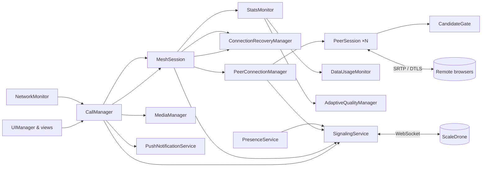
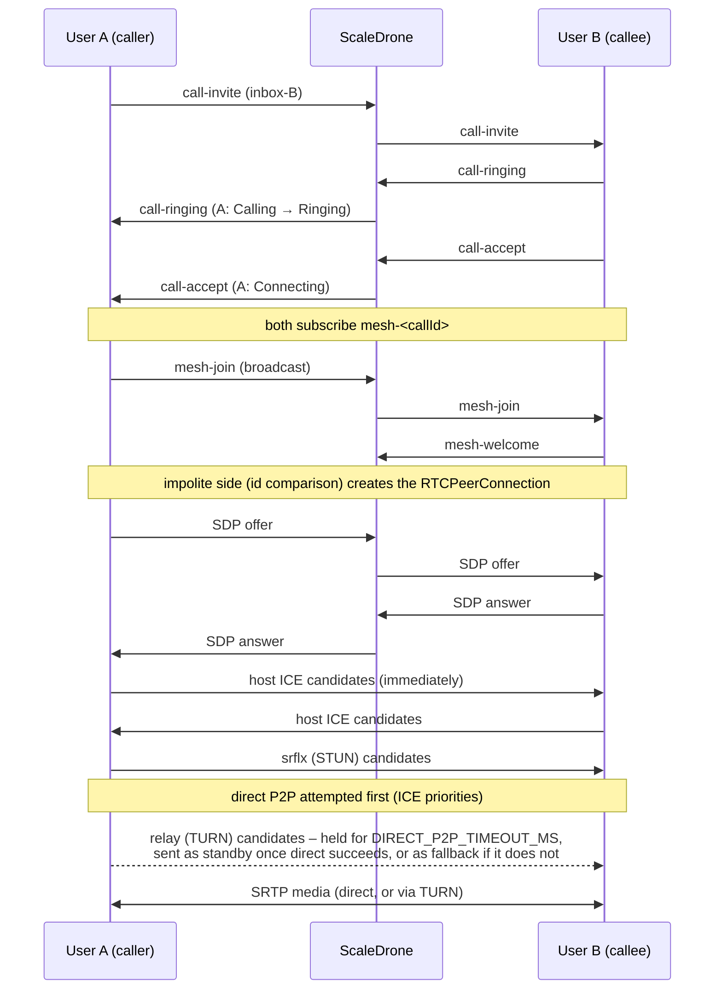
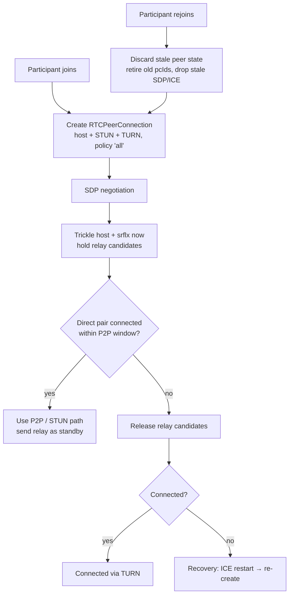
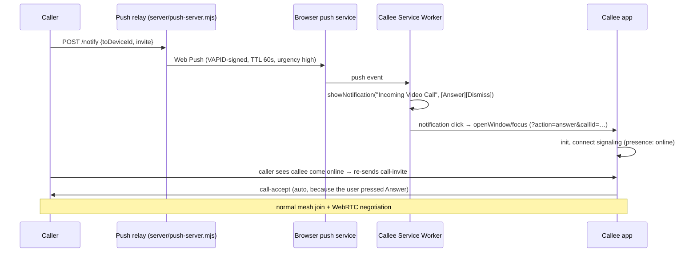

# MeshCall – P2P-first WebRTC mesh calling

A browser VoIP and video app built with Vite, TypeScript, WebRTC and ScaleDrone signaling. It supports:

- 1:1 audio and video calls
- group calls
- live streaming

It uses **mesh topology only**: there is no SFU, MCU or media server. Media always flows browser to browser. When direct connectivity is impossible, media goes through a TURN relay.

```bash
cp .env.example .env      # dev servers are pre-filled
npm install
npm run dev               # http://localhost:5173
npm run build             # type-check + production bundle in dist/
npm test                  # unit tests (vitest)
```

To test on phones or other PCs on your LAN, use `npm run dev:lan`. It serves over HTTPS with a self-signed certificate. HTTPS is required because camera, microphone, Service Worker and Push all need a secure context.

---

## Contents

1. [Architecture](#architecture)
2. [Mesh topology](#mesh-topology)
3. [Signaling](#signaling-scaledrone)
4. [Presence](#presence)
5. [1:1 call flow](#11-call-flow)
6. [Group call flow](#group-call-flow)
7. [Live stream](#live-stream)
8. [P2P-first strategy, STUN and TURN fallback](#p2p-first-strategy)
9. [Join and rejoin behaviour](#join--rejoin-behaviour)
10. [ICE restart and recovery](#ice-restart--recovery)
11. [Perfect Negotiation](#perfect-negotiation)
12. [Push notifications and Service Worker](#push-notifications--service-worker)
13. [Data usage and bandwidth monitoring](#data-usage--bandwidth-monitoring)
14. [Weak network handling](#weak-network-handling)
15. [Diagnostics: TURN, STUN and WebRTC debugging](#diagnostics--turn--stun--webrtc-debugging)
16. [Configuration and security](#configuration--security)
17. [Browser limitations](#browser-limitations)
18. [Mesh scalability limitations](#mesh-scalability-limitations)
19. [Testing](#testing)

More detail:

- [`docs/WEBRTC_EXPLAINED.md`](docs/WEBRTC_EXPLAINED.md) walks through every flow step by step: who sends what, when, and what happens on late, duplicate or lost messages.
- [`docs/SELF_AUDIT.md`](docs/SELF_AUDIT.md) lists the issues found during the final audit, each with its root cause, impact and fix.

---

## Architecture

```
src/
├── main.ts                     bootstrap (onboarding → services → UI)
├── app.ts                      composition root (creates + wires every service)
├── config.ts                   env-driven config, ICE servers (no secrets in code)
├── core/                       logger, typed emitter, async helpers, storage, formatting
├── types/                      signaling protocol, call/peer state, ScaleDrone typings
├── services/
│   ├── IdentityService         persistent deviceId + display name, per-load sessionId
│   ├── SignalingService        ScaleDrone transport, dedupe, outbox, liveness watchdog
│   ├── PresenceService         online/offline/connecting/unknown via observable lobby
│   ├── NetworkMonitor          online/offline, connection type, sleep/wake, resume
│   ├── NotificationService     in-app system notifications + SW click bridge
│   ├── PushNotificationService Web Push subscription + relay client
│   ├── SettingsService         quality, devices, ICE test mode
│   └── Ringtone                WebAudio ring/ringback
├── media/
│   ├── MediaManager            getUserMedia, mute, camera, screen share, device swap
│   ├── DeviceManager           enumerateDevices, hot-plug, permission changes
│   └── QualityPresets          Low/360p/480p/720p/1080p + audio bitrates
├── webrtc/
│   ├── WebRTCManager           RTCPeerConnection factory (P2P-first config)
│   ├── PeerSession             one RTCPeerConnection: Perfect Negotiation, ICE queueing
│   ├── PeerConnectionManager   sessions per remote, rejoin/recreate, stale-message filter
│   ├── IceStrategy             candidate gate (P2P window) + path classification
│   ├── ConnectionRecoveryManager  disconnected/failed → ICE restart → recreate
│   ├── StatsMonitor/StatsParser   getStats() polling and parsing (selected pair = truth)
│   ├── DataUsageMonitor        per-call byte accounting across reconnects
│   ├── AdaptiveLadder/AdaptiveQualityManager  hysteresis-based video adaptation
│   └── IceServerProbe          STUN/TURN health check
├── calls/
│   ├── CallManager             call state machine, invites, accept/reject/hangup, rejoin
│   ├── CallStateMachine        allowed status transitions
│   ├── MeshSession             membership protocol + wiring for one call/stream
│   ├── GroupCallManager        create/add/remove/leave
│   └── LiveStreamManager       go live, discovery, viewer cap
└── ui/                         UIManager + views (grid, call, sidebar, dialogs, diagnostics)
public/sw.js                    Service Worker (push → notification → open/focus app)
server/push-server.mjs          optional Web Push relay (VAPID)
```



The design follows three rules:

- **Call state is separate from DOM state.** Services hold plain data such as `CallState`, `ParticipantState` and `PeerConnectionState`. The UI reads that data and never stores call logic.
- **Signaling state is separate from WebRTC state.** `SignalingService` status, call status and per-peer `RTCPeerConnection` state are independent. For example, a signaling outage does not end a call whose media is still flowing.
- **Each module has one responsibility.** Dependencies are injected in `app.ts`.

## Mesh topology

```
 1:1                      Group (3)                     Live (broadcaster B)
 A ◀────▶ B                   A                          B ──▶ V1
                            ╱   ╲                        B ──▶ V2
                           B ─── C                       B ──▶ V3
```

Each participant keeps one `RTCPeerConnection` per remote participant, so a group of N has N·(N−1)/2 links. In a live stream only broadcaster↔viewer links exist. Viewers never connect to each other.

## Signaling (ScaleDrone)

The app uses channel `EoIG3R1I4JdyS4L1`, configurable with `VITE_SCALEDRONE_CHANNEL_ID`.

| Room | Purpose |
|---|---|
| `observable-lobby` | presence (ScaleDrone member list), heartbeats, live stream announcements |
| `inbox-<deviceId>` | directed messages: invites, SDP, ICE, welcome, reject… |
| `mesh-<callId>` | broadcast within a call: join, leave, heartbeat, media state |

Every message is a typed envelope (`src/types/signaling.ts`) containing:

- `messageId`: used for de-duplication (a bounded LRU set)
- `timestamp`
- `messageType`
- `senderId` and `receiverId`: persistent device IDs, never display names
- `senderSessionId`: changes on every reload, so reloads can be recognised as rejoins
- `callId`
- `peerId`: the sender's `RTCPeerConnection` id for negotiation messages
- `payload`

Negotiation messages also carry `pcId` and `targetPcId`. These let a peer discard SDP and ICE addressed to a connection that has since been replaced.

`SignalingService` has four robustness features:

- **Validation:** messages are structurally validated, and our own echoes are filtered out.
- **Outbox:** messages are queued while disconnected and flushed on reconnect. Anything older than 20 s is dropped.
- **Reconnect:** ScaleDrone's own auto-reconnect handles most drops. If ScaleDrone gives up, the client is re-created with exponential backoff.
- **Liveness watchdog:** ScaleDrone echoes our publishes back to us. If a publish is not echoed within 20 s, the socket is presumed dead and the client is re-created. This catches Wi-Fi changes and sleep, where a WebSocket often never errors.

## Presence

Presence uses the ScaleDrone *observable* lobby. Its member list and join/leave events are authoritative. Heartbeats every 20 s carry the display name, a busy flag and push capability.

| State | Meaning |
|---|---|
| **Online** | device has a session in the lobby, or it heartbeated recently |
| **Offline** | left, after a 10 s grace period, so a reload does not flash "Offline" |
| **Connecting** | our own signaling is connecting |
| **Unknown** | our own signaling is down, so we can't observe anyone |

A single missed heartbeat never marks a user offline. On `pagehide` the app sends a best-effort `presence-leave`, which makes a tab close show as offline immediately. Known users are kept in `localStorage`, so offline users still appear in the list.

## 1:1 call flow



Call statuses are Idle, Calling, Ringing, Connecting, Connected, Reconnecting, Ended, Failed, Rejected and Busy. Transitions are validated by `CallStateMachine`, and each status has its own UI. Every waiting state has a timeout, so the user is never left on a permanent spinner:

| Waiting state | Timeout |
|---|---|
| ringing | 45 s |
| no ringing ack from an offline callee | 8 s |
| accept → connect | 25 s |
| reconnecting | 45 s |

## Group call flow

1. The host creates the call, joins `mesh-<callId>`, and sends `call-invite` to each selected user.
2. Each invitee accepts and broadcasts `mesh-join`. Existing members reply with `mesh-welcome`.
3. For each pair, the **impolite** peer creates the connection and sends the offer.
4. Every member heartbeats every 10 s. The heartbeat carries its role, media state, and its `pcId` for every peer. This heals missed joins and detects orphaned one-sided connections.
5. **Leave:** the member broadcasts `mesh-leave`, and peers close only that member's connection.
6. **Remove participant:** the host broadcasts `mesh-remove`. The target leaves and is barred from rejoining.
7. **Add participant:** sends a new `call-invite` for the same `callId`.

The group is capped at `mesh.maxParticipants` (6), and the host enforces the cap.

## Live stream

The broadcaster joins as `broadcaster` and announces the stream in the lobby every 15 s. Viewers join as `viewer`:

- Transceivers are `sendonly` on the broadcaster and `recvonly` on viewers.
- Only broadcaster↔viewer links are created.
- When the broadcaster leaves, viewers see **Stream ended**.
- Viewers are capped at `mesh.maxLiveViewers` (8) and are rejected with `mesh-reject: full` beyond that.

> **Mesh bandwidth warning:** there is no media server, so the broadcaster uploads one full copy of its stream per viewer. At 1 Mbps and 8 viewers that is about 8 Mbps of upstream. The UI shows this warning before going live.

## P2P-first strategy

The strategy has two layers. Neither uses an arbitrary delay to hide a race.

**1. Native ICE prioritisation**

Configuration: `iceTransportPolicy: "all"`, `bundlePolicy: "max-bundle"`, `iceCandidatePoolSize: 2`.

RFC 8445 type preferences rank host (126) above prflx (110) above srflx (100) above relay (0). As a result, a working direct pair always outranks a relayed one. SDP priorities are **not** munged, because the browser defaults already express "direct first". Relay-only mode is never used in the normal flow.

**2. `CandidateGate`: the P2P window** (`src/webrtc/IceStrategy.ts`)

- Host and srflx candidates are trickled immediately.
- Local **relay** candidates are still gathered in parallel, so a TURN allocation is ready with no extra latency if it is needed. However, they are **held back** from the remote peer until one of these happens:
  - direct connectivity succeeds; the relay candidates are then sent as a *standby* fallback path;
  - `DIRECT_P2P_TIMEOUT_MS` (default 3000) elapses without a connection;
  - ICE reports `disconnected` or `failed`;
  - gathering finished and no non-relay candidate exists at all.
- An optional `HOST_ONLY_WINDOW_MS` also holds srflx candidates, giving host↔host (LAN) pairs a head start. It defaults to 0 because ICE priorities already prefer host pairs, so delaying srflx only slows down calls between different networks.
- The gate **never tears anything down**. It only decides *when* fallback candidates become available. A connection that is making progress is never interrupted.
- The gate is **re-armed on every new ICE generation**: a fresh connection, any ICE restart, or a rejoin. Each of these therefore gives direct P2P a new head start.

```
Peer connection ─┬─ host ↔ host ............................ P2P (LAN)
                 ├─ srflx involved (STUN-discovered NAT path) STUN (media still direct)
                 └─ relay (after the P2P window / failure) .. TURN
```

The chosen path is **never inferred from configuration**. `StatsMonitor` reads `getStats()` to find it:

1. Take `transport.selectedCandidatePairId`. Browsers without it fall back to `candidate-pair.selected`, or to a nominated and succeeded pair.
2. From that pair, read `local-candidate.candidateType` and `remote-candidate.candidateType`.
3. Classify the path with `classifyPath()`:
   - either side `relay` → **TURN**
   - `host → host`, or `prflx` between private addresses → **P2P**
   - otherwise → **STUN**

"TURN is required" is **never cached**. Every new connection, rejoin or ICE restart starts over at "direct first".

STUN uses `stun:dev.aahlaad.in:3401` plus Google's public STUN servers. Google's servers are STUN only, never TURN. The TURN relay fallback is `turn:dev.aahlaad.in:3401`. All of these are configurable.

## Join and rejoin behaviour



| Situation | What happens |
|---|---|
| Remote **reloads** (new `sessionId`) | Its old connection is closed and its old `pcId` retired. A brand-new `RTCPeerConnection` is created, so P2P is tried first again. |
| Remote **re-announces** with the same session (its signaling reconnected, and its network may have changed) | ICE restart on *that link only*. Other participants are untouched. |
| Offer arrives from a new remote `pcId` | The remote re-created its side, so a fresh connection is built here too. |
| SDP or ICE from a **retired** `pcId`, or addressed to one of our old `pcId`s | Dropped. |
| We reload during a call | A **Rejoin** banner appears. The saved call is kept in `sessionStorage` for 15 min. Rejoining is a fresh negotiation with everyone. |

## ICE restart and recovery

`ConnectionRecoveryManager` applies this policy per peer:

| Trigger | Action |
|---|---|
| `connected` | reset attempts |
| `disconnected` | wait 3 s (ICE often self-heals), then ICE restart |
| `failed` | ICE restart immediately |
| restart did not reconnect in time (10 s, 20 s, 30 s…) | ICE restart again |
| more than `maxIceRestarts` (3) restarts | re-create the `RTCPeerConnection` (full renegotiation); a circuit breaker allows at most 4 per peer per minute |
| negotiation stalled (offer re-sent twice, no answer) | re-create |
| browser **offline** | pause; attempts are not consumed |
| `online` / connection-type change / wake from sleep | ICE restart on **every** peer, because the path may be stale and direct P2P should be tried again |
| tab resumed after being hidden > 30 s / bfcache restore | ICE restart on unhealthy peers |
| signaling reconnected | re-announce in the mesh; restart unhealthy peers (a lost offer is re-sent by the negotiation watchdog) |

`navigator.onLine` is only a **hint**. It triggers re-validation and is never treated as proof that WebRTC works.

`pc.restartIce()` produces new ICE credentials. That means fresh gathering, a re-armed P2P window, and host candidates first again. ICE restart is make-before-break, so media keeps flowing on the old pair until a new pair is selected.

## Perfect Negotiation

`PeerSession` implements the W3C pattern:

- **Deterministic roles:** `polite = "${deviceId}|${sessionId}" > remote's`. Exactly one side of each pair is polite, even for two tabs on the same device.
- **Collision detection:** uses `makingOffer`, `ignoreOffer` and `isSettingRemoteAnswerPending`. The polite peer rolls back its own offer (implicit rollback). The impolite peer ignores the colliding offer.
- **Serial processing:** all incoming SDP and ICE for a peer is processed through a `SerialQueue`, so operations never interleave.
- **Stale answers:** an answer received while not in `have-local-offer` is a stale or duplicate answer and is ignored.
- **Initial offer:** only the impolite peer makes it, so a normal join never produces glare. Perfect Negotiation still covers later collisions, such as simultaneous ICE restarts, simultaneous re-creation, or a join during renegotiation.
- **Candidate queueing:** candidates that arrive before their SDP are queued per remote `pcId`. The same applies to a future ICE generation, detected when its `usernameFragment` differs. Queued candidates are applied after `setRemoteDescription`. Duplicates are de-duplicated by (ufrag, mid, candidate). A failing `addIceCandidate` is caught and never breaks the connection.
- **Lost messages:** a lost offer or answer is re-sent by a watchdog, and then escalated to re-creation.

## Push notifications and Service Worker



- **A Service Worker cannot hold a WebRTC call.** It has no `RTCPeerConnection`, and the browser kills it when it is idle. It can only show a notification. The call is negotiated after the user opens or focuses the app.
- **A relay server is required.** Browsers cannot send Web Push themselves: the VAPID private key must stay secret, and push services do not allow browser CORS requests. `npm run push-server` starts a small relay. Set `VITE_PUSH_SERVER_URL` to point at it. Without a relay, push is disabled and the UI says so.
- **Backgrounded tabs:** while the app is open but hidden, incoming calls use `registration.showNotification()`. A visible tab rings in-page.
- **iOS/iPadOS:** Web Push only works when the site is installed to the Home Screen (iOS 16.4 and later).
- **Offline callee without push:** if the callee is offline and push is unavailable, the call fails after 8 s with "User appears to be offline".

## Data usage and bandwidth monitoring

The scope is the **current call**. It resets when a call starts and survives reconnects.

- **Source of truth per peer:** `RTCTransportStats.bytesSent` and `bytesReceived`. These count everything on the bundled transport: RTP, RTCP, DTLS and STUN. Where transport stats don't exist (Firefox), the app sums candidate-pair bytes instead. Each packet travels on exactly one pair, so the sum does not double-count.
- **One report per peer per tick:** the app never adds RTP-level bytes on top of transport bytes. `pc.getStats()` is a superset of `RTCRtpSender.getStats()` and `RTCRtpReceiver.getStats()`, so calling all of them would double-count.
- **Counter resets:** counters restart at 0 when an `RTCPeerConnection` is re-created. `DataUsageMonitor` accumulates positive deltas per `pcId`, so totals don't reset or double on a reconnect.
- **Displayed values:** My Upload (the sum across peers; in a mesh you upload to each peer separately), per-peer received, total received, and upload/download bitrate. Units are shown as KB/MB/GB and kbps/Mbps.

## Weak network handling

**Monitored metrics:** RTT, jitter, inbound and outbound packet loss, packets discarded, frames dropped, available outgoing and incoming bitrate, codec, quality limitation reason, and the selected pair.

**Quality classes:**

| Class | RTT | Loss | Jitter |
|---|---|---|---|
| Excellent | < 200 ms | < 2 % | < 40 ms |
| Good | < 400 ms | < 5 % | < 80 ms |
| Poor | < 800 ms | < 12 % | — |
| Critical | above that, or no bytes received for 3 samples | | |

RTT and loss are smoothed with an EWMA.

**Adaptation (`AdaptiveLadder`, in "Auto" mode):**

- Each peer has its own ladder: 180p → 360p → 480p → 720p. Each peer gets its own encoding, so one weak link does not degrade the others.
- **Down:** after 2 consecutive bad samples. Critical drops two steps.
- **Up:** only after 5 consecutive good samples, a minimum dwell of 8 s, and 1.3× bandwidth headroom for the next level.
- **Anti-oscillation:** an up-step followed quickly by a down-step doubles the up-cooldown, up to a maximum of 120 s.
- **Starting level:** depends on mesh size, because every extra peer costs another full upstream copy.
- **Mechanism:** changes are applied with `RTCRtpSender.setParameters()`, using `maxBitrate`, `scaleResolutionDownBy` and `maxFramerate`. There is never a renegotiation or a rebuilt connection.
- **Fixed presets:** Low, 360p, 480p, 720p and 1080p set fixed encodings and camera capture constraints.
- **Audio:** runs at a high sender priority. Audio bitrate presets are 16, 32 and 64 kbps.

## Diagnostics: TURN, STUN and WebRTC debugging

Open the **Diagnostics** panel with the chart icon in the top bar.

**Per-peer diagnostics:**

- Connection State, ICE State, Signaling State, Gathering
- **Connection Type: P2P / STUN / TURN**
- **Candidate Pair: e.g. `host → host`**
- **Transport** (UDP/TCP, plus the relay protocol to the TURN server)
- **Path** (for example "Direct P2P (host / LAN)")
- Local and remote addresses
- relay-candidate gate state
- local and remote candidate counts by type
- time to connect, ICE restarts
- RTT, loss, jitter, bitrates, available bandwidth, codecs, resolution/fps, frames dropped
- ICE errors

A **Retry direct P2P** button forces an ICE restart for that peer.

**STUN / TURN health check:** the **Test STUN / TURN servers** button checks each configured URL in isolation:

- a STUN server passes if it yields an srflx candidate;
- a TURN server passes if it allocates a relay candidate (tested with `iceTransportPolicy: relay`).

This answers "is STUN reachable?" and "do TURN credentials work?" without making a call.

**ICE test modes** (Settings → Advanced) apply only to new connections and reset on reload:

- *Force TURN relay* uses `iceTransportPolicy: "relay"` and proves the relay path works.
- *Disable TURN* proves direct connectivity on its own.

**Console:** `window.__voip.diagnostics()` returns every peer's selected candidate pair, connection type, transport and counters as JSON. `window.__voip.probeIceServers()` runs the health check. Set Settings → Log level to `DEBUG` for detailed structured logs, such as `[ICE] Selected candidate pair = host → host`.

**Browser tools:** use `chrome://webrtc-internals` in Chrome or `about:webrtc` in Firefox for a raw view.

## Configuration and security

| Variable | Purpose |
|---|---|
| `VITE_SCALEDRONE_CHANNEL_ID` | ScaleDrone channel |
| `VITE_STUN_SERVER` | comma-separated STUN URLs |
| `VITE_TURN_SERVER`, `VITE_TURN_USERNAME`, `VITE_TURN_CREDENTIAL` | TURN relay |
| `VITE_DIRECT_P2P_TIMEOUT_MS` | P2P window before relay candidates are released (default 3000) |
| `VITE_HOST_ONLY_WINDOW_MS` | optional host-only head start (default 0) |
| `VITE_ICE_FALLBACK_MODE` | `gated` (default) or `native` |
| `VITE_RELAY_UPGRADE_PROBE_MS` | if > 0, periodically ICE-restart peers on relay to re-probe direct P2P |
| `VITE_PUSH_SERVER_URL`, `VITE_VAPID_PUBLIC_KEY` | Web Push relay |
| `VITE_LOG_LEVEL` | `ERROR` / `WARN` / `INFO` / `DEBUG` |

> ⚠️ **`VITE_*` variables are compiled into the JavaScript bundle and are public.** Anyone who opens the page can read the TURN username and credential. The values in `.env.example` are **development** credentials. In production, issue **short-lived TURN credentials** from a backend (the TURN REST API / coturn `use-auth-secret` HMAC scheme) and fetch them at runtime.

Other security notes:

- Credentials are never logged; the logger redacts `credential` and similar keys.
- Serve the app over HTTPS.
- ScaleDrone is used without JWT authentication here, so any client that knows the channel can publish, including spoofing a `senderId`. In production, enable ScaleDrone JWT authentication and put the push relay behind the same authentication.

## Browser limitations

- **Secure context:** camera, microphone, Service Worker and Push require HTTPS or localhost.
- **Hidden host IPs:** Chrome hides host IPs behind mDNS (`*.local`) until camera or microphone permission is granted. Receive-only viewers therefore expose only mDNS host candidates, which resolve on the same LAN only. A LAN `prflx` pair between private addresses is classified as P2P.
- **Autoplay policies** may block remote audio. A **Tap to enable audio** button appears when that happens.
- **Speaker selection** (`setSinkId`) is available in Chromium and Firefox 116+, not Safari.
- **Screen sharing** is desktop only.
- **Background throttling:** mobile browsers throttle or kill background tabs. The call recovers through ICE restart when the tab returns, but may drop if the OS kills the tab.
- **Web Push on iOS** requires the app to be installed to the Home Screen. A Service Worker can never run a call.
- **`navigator.connection`** (the Network Information API) exists only in Chromium, so network-change detection falls back to online/offline events, sleep detection and signaling liveness elsewhere.

## Mesh scalability limitations

With N participants, every client encodes and uploads **N−1 streams** and decodes N−1 streams:

| Participants | Upload per client at 720p (~1.6 Mbps each) |
|---|---|
| 2 | 1.6 Mbps |
| 4 | 4.8 Mbps |
| 6 | 8.0 Mbps |

"Auto" quality lowers the starting resolution as the mesh grows. The group cap is 6 and the live viewer cap is 8. Beyond roughly 4–6 video participants, or a handful of viewers, an SFU is the right architecture. This project deliberately does not include one.

## Testing

```bash
npm test                       # unit tests (candidate gate, path classification, stats parsing,
                               #   data usage, hysteresis, recovery re-entrancy, state machine…)
npm run dev &                  # then, with a real ScaleDrone channel:
npm run test:e2e               # two/three-browser end-to-end suite (headless Chrome, fake media)
npm run test:resilience        # glare, offline→online, signaling reconnect, peer vanishes
npm run test:screens           # responsive screenshots → tests/e2e/artifacts/
```

The e2e suite checks:

- presence
- 1:1 video with **direct P2P selected**
- media flowing
- ICE restart on network change
- **rejoin creates a new connection and tries P2P again**
- hangup cleanup (camera, microphone and peer connections released)
- reject
- STUN reachability
- **forced TURN relay (relay → relay) with media flowing**
- **the next call after a TURN call goes direct again**
- a three-way group mesh
- leave and rejoin in a group
- live streaming with two viewers
- stream-ended handling

To exercise the relay path locally without an external TURN server, run a throwaway TURN server:

```bash
node tests/e2e/local-turn.mjs &                               # UDP 3479, user e2e / e2e-secret
VITE_TURN_SERVER=turn:<LAN-IP>:3479 VITE_TURN_USERNAME=e2e VITE_TURN_CREDENTIAL=e2e-secret \
  npx vite --port 5174 &
E2E_URL=http://localhost:5174/ npm run test:e2e
```

These scenarios need real devices or networks and are not automated: Wi-Fi ↔ hotspot switching, genuine NAT and firewall fallback, 3G throttling, push delivery to a closed browser, and permission denial. Use Chrome DevTools network throttling, `chrome://webrtc-internals`, and the Diagnostics panel for manual verification.
